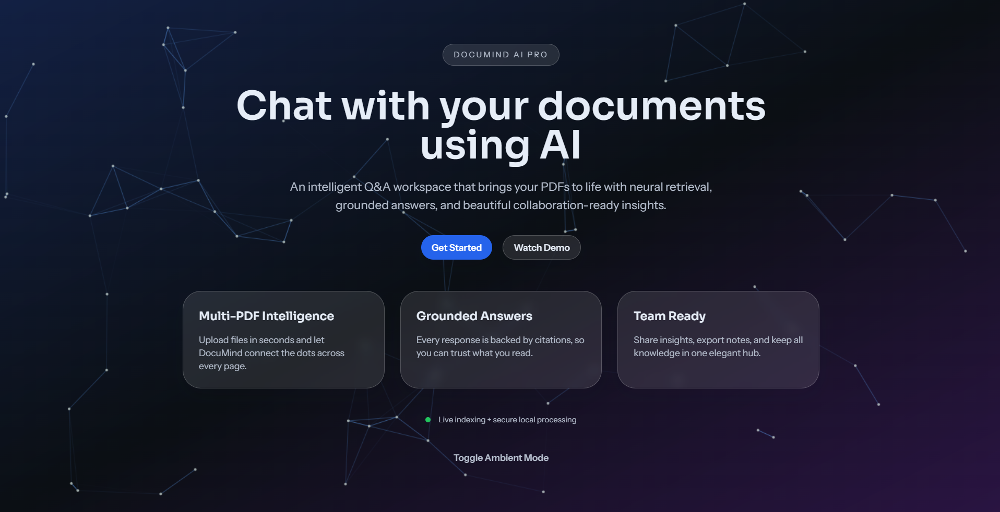
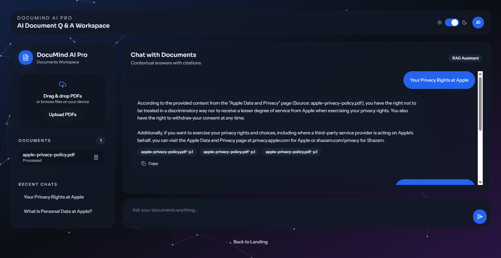

# DocuMind AI Pro ? Multi-Document Conversational RAG System

## Overview

DocuMind AI Pro is an advanced Retrieval-Augmented Generation (RAG) system that allows users to chat with multiple PDF documents using a local Large Language Model. Instead of manually reading long documents, users can ask questions and get accurate, context-aware answers grounded in the document content.

## Key Features

- Multi-PDF upload and processing
- Semantic search using embeddings
- Vector database (Chroma)
- Local LLM via Ollama (Llama 3)
- Conversational chat (RAG pipeline)
- Source citation (document traceability)
- Reranking for improved accuracy
- RAG evaluation using RAGAS
- React UI + Streamlit UI

## Screenshots

Landing page preview:



Dashboard preview:



## System Architecture (Mermaid)


## Usage

### Run CLI App

```bash
python app.py
```

### Run API Server (for React UI)

```bash
python -m pip install -r requirements.txt
uvicorn api:app --reload --port 8000
```

### Run React UI

```bash
cd UI
npm install
npm run dev
```

### Run Streamlit UI

```bash
streamlit run ui/streamlit_app.py
```

## Add Documents

1. Place PDFs inside:

```
data/
```

2. Run the app ? embeddings will be created automatically.

## How It Works

### Step 1: Document Ingestion

- PDFs are loaded and split into chunks
- Metadata (source, page) is attached

### Step 2: Embeddings

- Text is converted into vectors using HuggingFace models

### Step 3: Vector Storage

- Stored in Chroma DB for fast similarity search

### Step 4: Retrieval

- Top-k relevant chunks are fetched

### Step 5: Reranking

- Improves relevance of retrieved chunks

### Step 6: Generation

- LLM generates answer using retrieved context

## Evaluation

This project uses RAGAS to evaluate performance.

### Metrics Used

- Faithfulness
- Answer relevancy
- Context precision

### Run Evaluation

```bash
python src/evaluation/ragas_eval.py
```

## Sample Query

```
Q: Why does Apple use personal data?

A: Apple uses personal data to provide services, process transactions, ensure security, and comply with legal obligations.
Source: apple-privacy-policy.pdf
```

## Tech Stack

- Python
- LangChain
- ChromaDB
- HuggingFace Transformers
- Ollama (Llama 3)
- Streamlit
- React + Vite + Tailwind

## Advanced Features

- Multi-document retrieval
- Hybrid search (extendable)
- Reranking model integration
- Persistent vector database
- Modular architecture

## Future Enhancements

- User authentication
- Web search integration
- Evaluation dashboard
- Cloud deployment (AWS / Hugging Face)
- Memory-based conversations

## Learning Outcomes

- Understanding of RAG architecture
- Vector databases and embeddings
- LLM integration (local models)
- Evaluation of AI systems
- Building end-to-end AI applications

## Author

Jatin Shewale

## Acknowledgment

Inspired by modern AI systems and RAG-based architectures used in industry.

## License

This project is for educational and research purposes.
